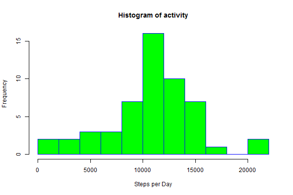

##This assignment makes use of data from a personal activity monitoring device.This device collects data at 5 minute intervals through out the day. The data consists of two months of data from an anonymous individual collected during the months of October and November, 2012 and include the number of steps taken in 5 minute intervals each day.

###load required packages
```{r}
library(knitr)
library(readr)
library(lubridate)
library(lattice)
```
###Loading and preprocessing the data

*Create Data repo*
```{r}
if(!dir.exists('./Data')){dir.create('./Data')}
```
*Create a "Figures"" repo*
```{r}
if(!dir.exists('./Figures')){dir.create('./Figures')}
```
*Load data*
```{r}
if(!file.exists('./Data/activity.csv')){
    fileUrl<- 'https://d396qusza40orc.cloudfront.net/repdata%2Fdata%2Factivity.zip'
    download.file(fileUrl,destfile='./Data/activity.zip',mode = 'wb')
    unzip('./Data/activity.zip')
}
data <- read_csv("activity.csv")
```
*Preprocessing the date variable*
```{r}
data$date <- ymd(data$date)
```
###What is mean total number of steps taken per day?

####Make a histogram of the total number of steps taken each day.
```{r}
days <- aggregate(steps ~ date, data=data, FUN="sum")

png('./Figures/gr1.png',width=600,height=400)
hist(days$steps,breaks = 12, col = "green", border = "blue", main="Histogram of activity", xlab = "Steps per Day")
dev.off()
```


####Calculate and report the mean and median total number of steps taken per day
```{r}
median(days$steps, na.rm=TRUE)
mean(days$steps, na.rm=TRUE)
```
###What is the average daily activity pattern?

####Make a time series plot (i.e. type = "l") of the 5-minute interval (x-axis) and the average number of steps taken, averaged across all days (y-axis).
```{r}
interval <- aggregate(steps ~ interval, data=data, FUN = mean, na.rm = TRUE)
colnames(interval) <- c("interval", "average.steps")

png('./Figures/gr2.png',width=600,height=400)
plot(interval$interval, interval$average.steps, 
     type = "l", main = "Average daily activity pattern", 
     xlab = "5-minute interval", 
     ylab = "Average number of steps taken")
dev.off()
```


####Which 5-minute interval, on average across all the days in the dataset, contains the maximum number of steps?
```{r}
intervalsum <- aggregate(steps ~ interval, data=data, FUN = sum, na.rm = TRUE)
intervalsum$interval[which.max(interval$average.steps)]
max(intervalsum$step)
```
#### The 5-minute interval, with the maximum steps occurs at 8:35 AM and has 10927 steps occurs during it. 

###Imputing missing values
####Calculate and report the total number of missing values in the dataset (i.e. the total number of rows with NAs).
```{r}
nrow(subset(data, is.na(steps)))
```
####Devise a strategy for filling in all of the missing values in the dataset. The strategy does not need to be sophisticated.
```{r}
data1 <- data
data1$steps[is.na(data1$steps)]  <- 0
```
####Make a histogram of the total number of steps taken each day and Calculate and report the mean and median total number of steps taken per day.
```{r}
days1 <- aggregate(steps ~ date, data=data1, FUN="sum")

png('./Figures/gr3.png',width=600,height=400)
hist(days1$steps,breaks = 12, col = "green", border = "blue", main="Histogram of activity",xlab = "Steps per Day")
dev.off()
```


###Do these values differ from the estimates from the first part of the assignment? What is the impact of imputing missing data on the estimates of the total daily number of steps?

####Calculate and report the mean and median total number of steps taken per day
```{r}
median(days1$steps)
mean(days1$steps)
```
####The estimates are are different, but posses very similar values. 

###Are there differences in activity patterns between weekdays and weekends?
```{r}
weekday <- tolower(weekdays(data1$date))
```
*Create a variable that indicates weekday or weekend.*
```{r}
data1$daytype <- as.factor(ifelse(weekday == "saturday" | weekday == "sunday", "weekend", "weekday"))
```
####Make a panel plot containing a time series plot (i.e. type = "l") of the 5-minute interval (x-axis) and the average number of steps taken, averaged across all weekday days or weekend days (y-axis). 
```{r}
weekData1 <- aggregate(steps ~ interval+daytype, data=data1, FUN="mean")

png('./Figures/gr4.png',width=600,height=400)
xyplot(steps ~ interval | daytype, data=weekData1, type="l", lwd=2, layout=c(1,2), 
       xlab = "5-minute interval", ylab = "Average number of steps",
       main = "Average Number of Steps on 5-minute interval \n(across all weekday/weekend days)")
dev.off()
```
